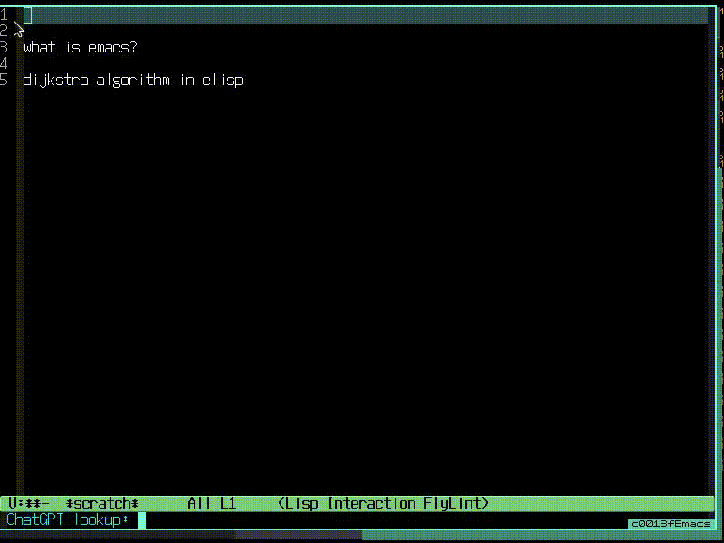
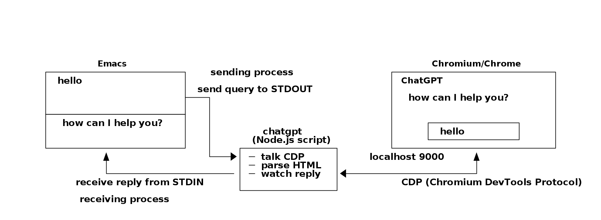

# NAME

chatgpt-el - access ChatGTP from Emacs without OpenAI API



# DESCRIPTION

**chatgpt-el** is an Emacs Lisp program designed to interactively
access ChatGPT (https://chat.openai.com/) from within Emacs.  While
ChatGPT can be accessed via OpenAI API using a programming language
like Python and its openai module, such access has several drawbacks.

1. Batch processing through OpenAI API is slow; accessing OpenAI API
   is slow, and responses can often take an unnecessarily long
   time. Such slow response times can make accessing ChatGPT
   frustrating.

2. Accessing ChatGPT via OpenAI API requires a non-free OpenAI account
   with credit card registration. Frequent use of ChatGPT can lead to
   high costs and require monitoring of OpenAI billing records.

**chatgpt-el** solves the above issues by enabling access to ChatGPT
within Emacs without the use of an OpenAI API key.  The program is
implemented using Chromium/Chrome browser's CDP (Chrome DevTools
Protocol) (https://chromedevtools.github.io/devtools-protocol/), and
therefore requires a CDP-enabled Chromium/Chrome browser to be
running.  **chatgpt-el** operates by remotely controlling your
instance of Chromium/Chrome using the Node.js script called `chatgpt`,
which is built on the Puppeteer library
(https://pptr.dev/). Therefore, your Chromium/Chrome browser must
accept a CDP connection from the `chatgpt` script.



Note that the implementation of the `chatgpt` script depends on the
internal structure of the HTML file returned by the ChatGPT server. If
`chatgpt` does not work in your environment, you may need to modify
the program according to your environment.

# PREREQUISITES

- Chromium or Chrome browser (or other browsers supporting the CDP protocol).
- Node.js (https://nodejs.org/en).
- html-to-text moudle (https://github.com/html-to-text/node-html-to-text)

# INSTALLATION

``` sh
> sudo npm i -g puppeteer
> sudo npm i -g html-to-text
> git clone https://github.com/h-ohsaki/chatgpt-el.git
> cd chatgpt-el
> sudo intall -m 644 chatgpt.el /usr/local/share/emacs/site-lisp
> cat <<EOF >>~/.emacs
;; chatgpt-el
(autoload 'chatgpt-query "chatgpt" nil t)
(autoload 'chatgpt-insert-reply "chatgpt" nil t)
(global-set-key "\C-cq" 'chatgpt-query)
(global-set-key "\C-cQ" 'chatgpt-insert-reply)
(setq chatgpt-prog "../path/to/chatgpt-el/chatgpt")
EOF
```

You can place `chatgpt` script anywhere in your system, but Node.js
modules such as Puppeteer and html-to-text must be accessible from
`chatgpt` program.

# USAGE

1. Start Chromium/Chrome browser with remote debugging on port 9000.

``` sh
> chromium --remote-debugging-port=9000
```

2. Visit ChatGPT (https://chat.openai.com/) in Chromium/Chrome, and
   login with your OpenAI account.

3. On Emacs, move the point (i.e., the cursor in Emacs) around the
   paragraph of the query.  Alternatively, you can select the region
   containing the query.  Then, type `C-c q` or execute `M-x
   chatgpt-query`.  With a prefix argument (e.g., `C-u C-c C-q`), you
   will be prompted what query prefix is prepended to the query.

4. The query is automatically submitted to ChatGPT in your
   Chromium/Chrome.  The reply from ChatGPT will be displayed in
   another buffer in Emacs.

5. Once the reply is displayed, type `C-c Q` or execute M-x
   chatgpt-insert-reply from Emacs.  The reply from ChatGPT is
   inserted at the current point.

# TROUBLE SHOOTING

1. Make sure your Chromium/Chrome accepts a CDP connection on
   localhost:9000.
   
``` sh
> telnet localhost 9000
Trying 127.0.0.1...
Connected to localhost.
Escape character is '^]'.
GET /json/version HTTP/1.1

HTTP/1.1 200 OK
Content-Security-Policy:frame-ancestors 'none'
Content-Length:391
Content-Type:application/json; charset=UTF-8

{
   "Browser": "Chrome/112.0.5615.121",
   "Protocol-Version": "1.3",
   "User-Agent": "Mozilla/5.0 (X11; Linux x86_64) AppleWebKit/537.36 (KHTML, like Gecko) Chrome/112.0.0.0 Safari/537.36",
   "V8-Version": "11.2.214.14",
   "WebKit-Version": "537.36 (@39cc...2268)",
   "webSocketDebuggerUrl": "ws:///devtools/browser/e32f...ca87"
}
```

2. Send a query from the command line using `chatgpt` script.

``` sh
> echo hello | ./chatgpt -s
```

You should see that "hello" is sent to ChatGPT in your Chromium/Chrome
browser.

3. Receive a reply from the command line using `chatgpt` script.

``` sh
> ./chatgpt -r
Hello! How can I assist you today?

EOF
```

This will show the reply from ChatGPT, which must be equivalent to
that shown in your Chromium/Chrome.

# FOR QUTEBROWSER USERS

If you are a qutebrowser user instead of Chromium/Chrome, you can use
**qutechat** (https://github.com/h-ohsaki/qutechat), an extension to
**chatgpt-el** supporting qutebrowser.
